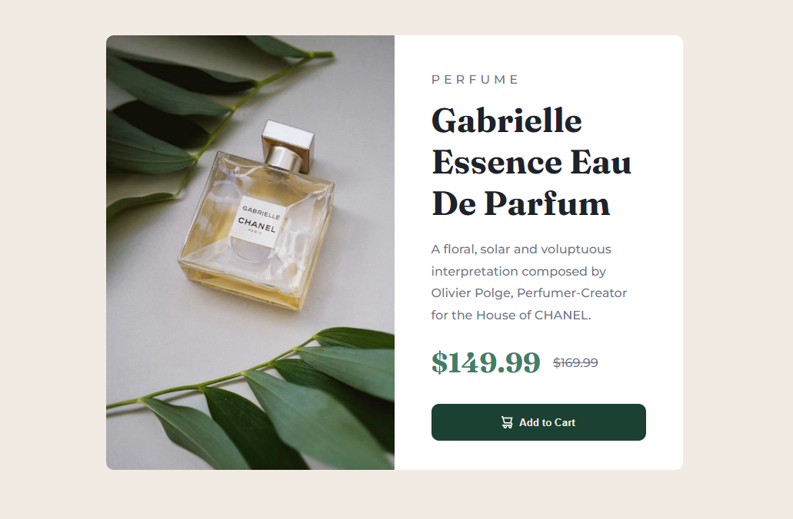

# Frontend Mentor - Product preview card component

This is a solution to the [Product preview card component challenge on Frontend Mentor](https://www.frontendmentor.io/challenges/product-preview-card-component-GO7UmttRfa). Frontend Mentor challenges help you improve your coding skills by building realistic projects. 

## Table of contents

- [Overview](#overview)
  - [The challenge](#the-challenge)
  - [Screenshot](#screenshot)
  - [Links](#links)
- [My process](#my-process)
- [Built with](#built-with)
- [What I learned](#what-i-learned)
- [Continued development](#continued-development)
- [Useful resources](#useful-resources)
- [Author](#author)
- [Acknowledgments](#acknowledgments)

## Overview 
Hello fellow developers! I’m pleased to present my solution for the Product Preview Card Component challenge from Front-end Mentor. In this project, I prioritized clean and well-organized code. I also had the chance to experiment with responsive images, which was quite exciting. Leveraging SASS(SCSS) and BEM methodology, I aimed for a more modular and maintainable codebase. For the card’s overall layout, I combined CSS Grid and Flexbox. 🚀💻

### The challenge

Users should be able to:
Users should be able to:

- View the optimal layout depending on their device's screen size
- See hover and focus states for interactive elements

### Links

- [Solution URL](https://github.com/HosseinHeydarpour/results-summary-component)
- [Live Site URL](https://hosseinheydarpour.github.io/results-summary-component)

## My process
I employed CSS Grid and Flexbox to create the overall layout, and I utilized SASS to enhance the code’s usability

### Built with
- Semantic HTML5 markup
- CSS 
- Flexbox
- CSS Grid
- Desktop-first workflow
- SASS

### What I learned
This challenge really helped me to undrestand CSS grid and Flex-box better for creating great layouts like this.

### Continued development
I still want to improve and enhace my abilities in CSS grid and Flex-box.

## Author
- Frontend Mentor - [@HosseinHeydarpour](https://www.frontendmentor.io/profile/HosseinHeydarpour)
- Linkedin - [@hosseinheydarpour](www.linkedin.com/in/hosseinheydarpour)

